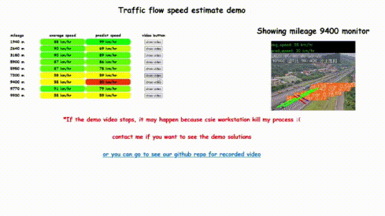
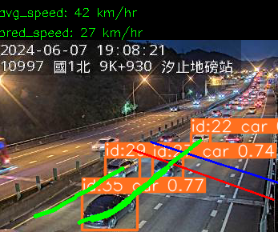
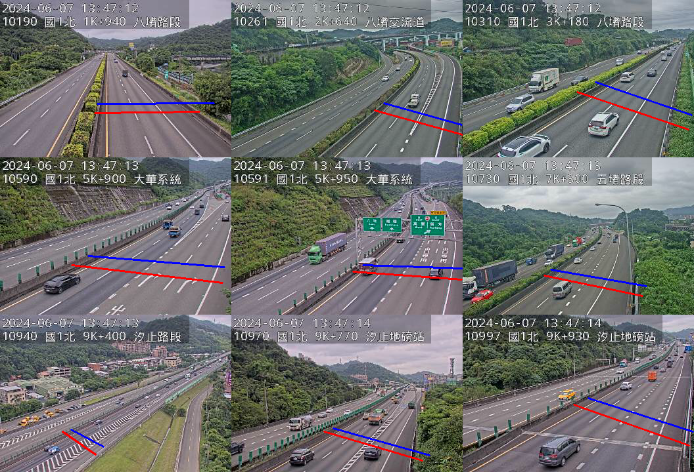
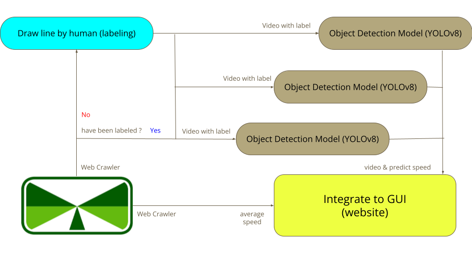
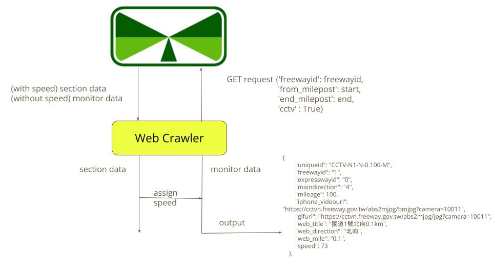
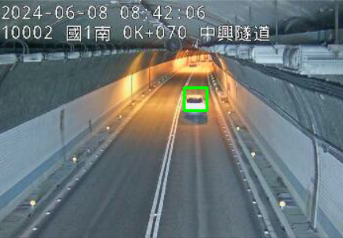

This repo is an implement of final project from course Introduction to Intelligent Vehicles （智慧型汽車導論）


## feature

- real-time car speed detection for the whole Taiwan Highway  

- several monitor from  Xizhi to Keelung has been labeled  

- real-time velocity with eye-catching colors

- the demo website is at [here](https://www.csie.ntu.edu.tw/~b10902048/)

## environment setup

Our recommend python version is `3.10.5`  
Simply run the command:
```
pip install ultralytics
```
and it would install all package you need.

Or you can build up the environment with command:
```
pip install -r requirements.txt
```
## pipeline of this project:


## each file usage (待寫)

### Web Crawler


- `/crawl/jsondata.py`

- `/crawl/download.py`

### Main function

- `main.py`

### GUI

- `gui.py`

### Run with remote server

- `remote_gui/gui.py`

## Appendix: traditional method
  
run the following command:
```
cd Traditional
python car_detection.py
```


