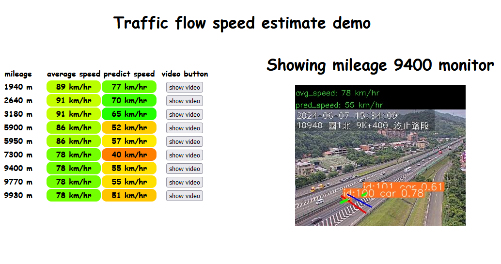

This repo is an implement of final project from course Introduction to Intelligent Vehicles （智慧型汽車導論）



## feature

- real-time car speed detection for the whole Taiwan Highway

- several monitor from  Xizhi to Keelung has been labeled

- the demo website is at [here](https://www.csie.ntu.edu.tw/~b10902048/)
- video:

- 

## environment setup

Our recommend python version is `3.10.5`
simply run the command:
```
pip install ultralytics
```
and it would install all package you need.

Or you can build up the environment with command:
```
pip install -r requirements.txt
```

## traditional method

I don't know how to run this code..

## pipeline of this project:


